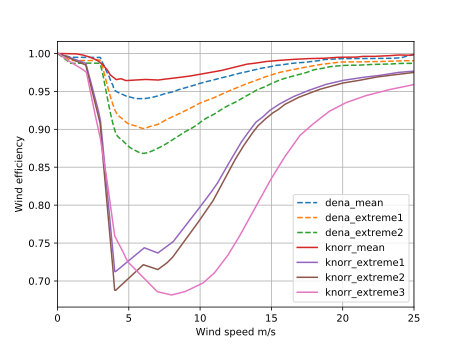

~~~~~~~~~~~~~~~~~~~~~~
Model description
~~~~~~~~~~~~~~~~~~~~~~

Wind power plants
=================

The windpowerlib provides three classes for modelling wind power as wind turbines (:py:class:`~.wind_turbine.WindTurbine`),
wind farms (:py:class:`~.wind_farm.WindFarm`) and wind turbine clusters (:py:class:`~.wind_turbine_cluster.WindTurbineCluster`).

Descriptions can also be found in the sections
:ref:`wind_turbine_label`, :ref:`wind_farm_label` and :ref:`wind_turbine_cluster_label`.

Height correction and conversion of weather data
================================================

Weather data is usually available for a restricted amount of heights above ground.
However, for wind feed-in time series calculations weather data is needed at hub
height of the examined wind turbines. Thus, the windpowerlib provides functions for the height
correction of weather data.

Functions for the height correction of wind speed to the hub height of a wind turbine are described in the
:ref:`windspeedmodule-label` module. Respectively a function for the height correction of temperature data is provided in the
:ref:`temperature_module_label` module. Functions for density calculations can be found in the
:ref:`density_module_label` module.

If weather data is available for at least two different heights the respective figure at hub height
can be determined by using linear or logarithmic inter-/extrapolation functions of the :ref:`tools_module_label` module.

Power output calculations
=========================
Wind feed-in time series can be calculated via power curves and power coefficient curves in the windpowerlib.
Functions for power output calculations are described in the :ref:`poweroutput_module_label` module.

Wake losses
===========
The windpowerlib provides two options for the consideration of wake losses in wind farms:
reduction of wind speeds and wind farm efficiency (reduction of power in power curves).

For the first option wind efficiency curves are provided which determine the
average reduction of wind speeds within a wind farm induced by wake losses depending on the wind speed. These curves
were taken from the dena-Netzstudie II and the dissertation of Kaspar Knorr
(for references see :py:func:`~.get_wind_efficiency_curve`).
The following graph shows all provided wind efficiency curves. The mean wind efficiency curves were calculated in
the dena-Netzstudie II and by Kaspar Knorr by averaging wind efficiency curves of 12 wind farms distributed over Germany (dena) or
respectively of over 2000 wind farms in Germany (Knorr). Curves with the appendix 'extreme'
are wind efficiency curves of single wind farms that are extremely deviating from the respective
mean wind efficiency curve.

The second option of considering wake losses is applying them to power curves by reducing the power values
by a constant or on a wind speed depending wind farm efficiency (see :py:func:`~.wake_losses_to_power_curve`).
Applying the wind farm efficiency (curve) to power curves instead of to feed-in time series has the advantage that the
power curves can further be aggregated to achieve turbine cluster power curves (see :py:class:`~.wind_turbine_cluster.WindTurbineCluster`).

Smoothing of power curves
=========================

To account for the spatial distribution of wind speeds within an area the windpowerlib provides a
function for power curve smoothing and uses the approach of Nørgaard and Holttinen (for references see :py:func:`~.smooth_power_curve`).

The modelchains
===============

The modelchains are implemented to ensure an easy start into the Windpowerlib. They work
like models that combine all functions provided in the library. Via parameteres desired functions
of the windpowerlib can be selected. For parameters not being specified default parameters are used.
The :ref:`modelchain_module_label` is a model
to determine the output of a wind turbine while the :ref:`tc_modelchain_module_label` is a model to determine
the output of a wind farm or wind turbine cluster.
The usage of both modelchains is shown in the :ref:`examples_section_label` section.
